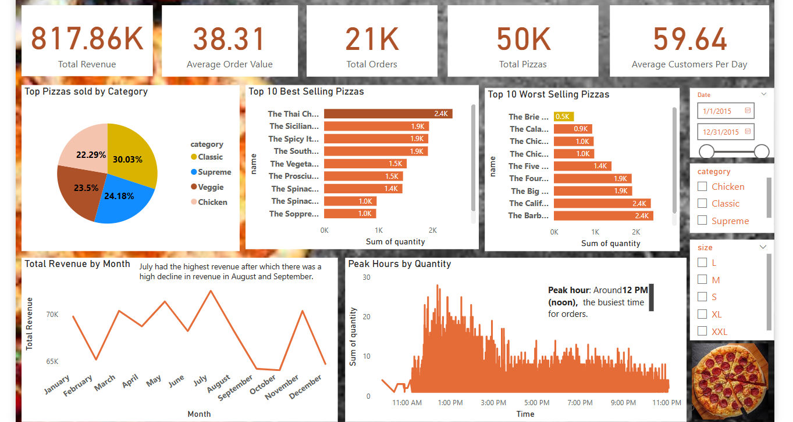

# Sandyks-_Pizza
Power BI dashboard and analysis for Sandyks'_Pizza (Mavern Pizza Challenge)

**Project Objectives**
Sandyks'_Pizza, a Greek-inspired restaurant in New Jersey, collected transactional data for the past year and needed help using it to improve operations. As a Data Analyst, my role is to analyze the data and answer the following key questions:
1. How many customers do we have each day? Are there any peak hours?
2. How many pizzas are typically in an order? Do we have any bestsellers?
3. How much money did we make this year? Can we identify any seasonality in the sales?
4. Are there any pizzas we should take off the menu, or any promotions we could leverage?

**Methodology**
1. Data Import. Cleaned in Excel and loaded into Power BI
2. Data Transformation
1. Extracted date and time elements (hour, day, month)
2. Created calculated columns and measures using DAX
3. Data Modeling
1. One main table used: order_details
2. Relationships established as needed between order_details and Caledendar
4. Visualizations Created
1. KPI Cards (Revenue, Orders, Avg Pizzas per Order)
2. Line charts (Orders per Hour, Monthly Revenue)
3. Bar charts (Best/Worst Selling Pizzas)
4. Slicers for interactivity

**Dashboard Overview**

**Dashboard Features**
1. Total Revenue and Orders KPIs
2. Peak Hour Analysis
3. Orders Per Day and Weekly Trends
4. Best and Worst Selling Pizzas
5. Monthly Revenue Trends & Seasonality
6. Interactive slicers for date and pizza type

**Insights & Recommendations**
1. Orders peak around 12 PM, suggesting targeted lunch promotions.
2. Top-selling pizzas such as the Thai Chicken Pizza could be bundled for combo deals.
3. Low-performing pizzas such as The Brie Carre Pizza could be reviewed for removal or marketing.
4. Revenue spikes in May and July, indicating seasonal patterns.

**How to Use**
1. Download the pizza project file.
2. Open it in Power BI Desktop.
3. Interact with slicers and visuals to explore trends and patterns.

**Credits**
1. Data source: Maven Analytics - Maven Pizza Challenge
2. Dashboard built by: **Sandra Koranteng**
3. Tools: Excel, Microsoft Power BI, DAX, GitHub

